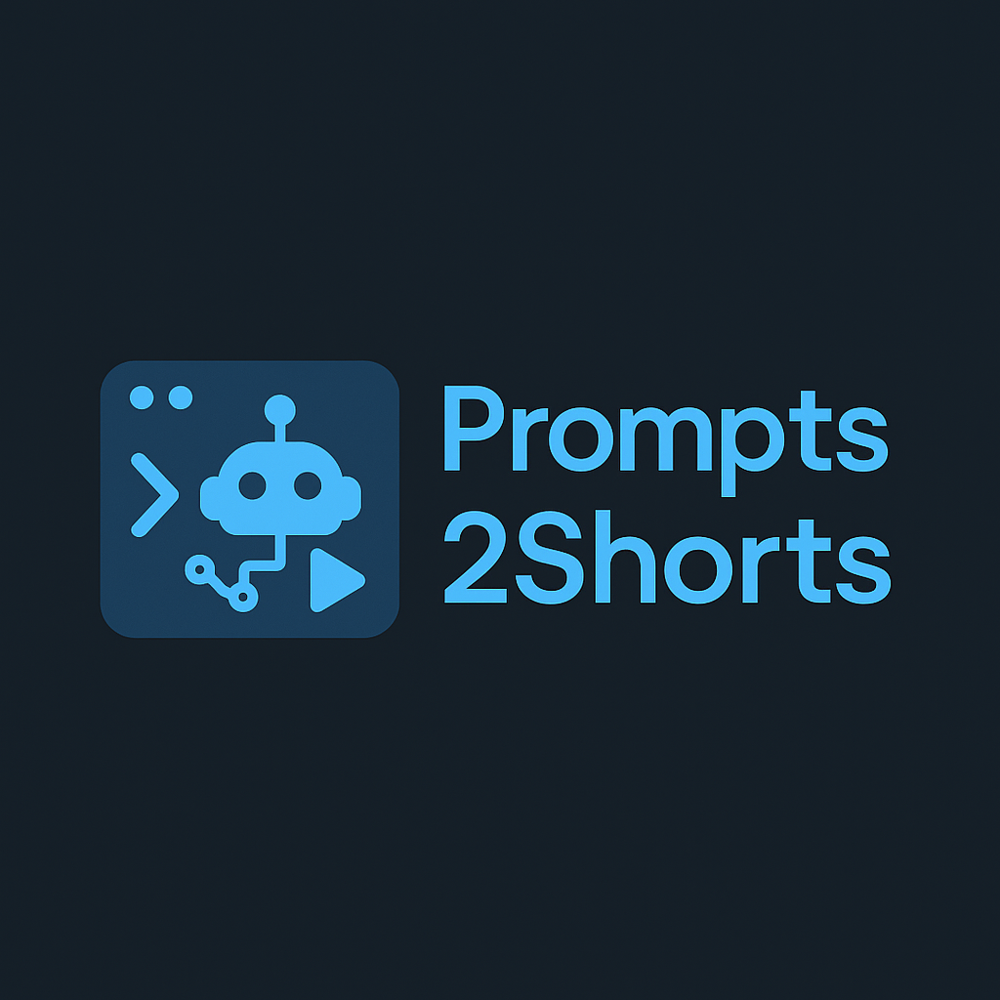

<p align="center">
  
</p>

**Prompts2Shorts** is a Python-based tool that converts your text prompts into AI-generated short-form videos for platforms like TikTok, YouTube Shorts, Instagram Reels, and more. It leverages generative AI models to produce visuals, audio, and video edits, fully automated via command-line.

---

## 🔧 Features

* 🎥 Generate short videos from a single prompt
* 🧠 Vast amount of completely free AI models that require no API key
* ⚙️ Highly customizable video generation settings
* 🎞️ Many transition and panning effects
* ⚡ CUDA/CPU acceleration supported

---

## 🚀 Installation (v1.2.1)

Clone the repository and install the required dependencies:

```bash
git clone https://github.com/TheTank10/Prompts2Shorts.git
cd Prompts2Shorts
pip install -r requirements.txt
```

Or..

Download the [latest release](https://github.com/TheTank10/Prompts2Shorts/releases)

You also **must install [FFmpeg](https://www.ffmpeg.org/download.html)**. When you first run with `--create`, the program will prompt you to specify the FFmpeg executable path. If it's already added to your system's PATH, you can just enter `ffmpeg`.

Optionally you can use `--downloadffmpeg` to automatically download the required FFmpeg version for your device. This is recommended but it might not work for you. If it doesn't work download it from the official page and enter the path to the exe when you run `--create`.

> FFmpeg version: >= `7.1.1`
> Python version: `3.10.0`

---

## 🛠️ Usage

Run the program via command line with one of the available options:

### 🎮 Create a Video

```bash
# Create a single video in the command line with a prompt
python app.py --create --prompt="A video about anything you want"

# Create multiple videos with different prompts from a text file. 
# Each prompt in the text file must be split by ';'
python app.py --create --prompts="example_prompts.txt"
```

**Optional Flags:**

* `-st`, `--settings`: Use a custom video settings file from [`data/settings/video_settings/`](data/settings/video_settings/). Do not include the `.json` extension.

  ```bash
  --settings="my_custom_config"
  ```

  Default: [`default.json`](data/settings/video_settings/default.json)
  Example path: [`my_custom_config.json`](data/settings/video_settings/my_custom_config.json)

* `-t`, `--template`: Allows you to choose between different templates for your video. Options: `ai` (default), `duckduckgo`.

* `-rt`, `--retries`: Number of retries if generation fails (default: 5)

* `-pr`, `--print`: Whether to show logs in the console during video generation (default: True)

* `-em`, `--editmode`: Allows you to edit content text and image prompts while the video is being generated. Allows for higher quality videos even more using --enhance. (default: False)

To learn how to customize your video settings or create your own, refer to the [`SETTINGS REFERENCE.md`](data/settings/video_settings/SETTINGS%20REFERENCE.md) file inside [`video_settings/`](data/settings/video_settings/).

Run the -h flag for more information.

### 📁 Clear Temporary Files

```bash
python -m prompts2shorts --cleartemp
```

This deletes files in the temporary folder. Normally this happens automatically after a video is successfully generated, but you can run this manually if something went wrong and temporary files were left over.

### 📦 Update AI Model List

```bash
python -m prompts2shorts --getmodels
```

Gets a list of the latest AI models from Pollinations and saves them as:

* [`pollination_text_models.json`](src/ai/pollination_models/pollination_text_models.json)
* [`pollination_image_models.json`](src/ai/pollination_models/pollination_image_models.json)

---

## ⚙️ Custom Settings

Video generation is highly customizable via the [`video_settings`](data/settings/video_settings/) directory. You can:

* Create your own JSON config files for rendering
* Set parameters such as resolution, frame rate, font, and subtitle behavior
* Swap image/text models used in generation

> 📜 Refer to [`SETTINGS REFERENCE.md`](data/settings/video_settings/SETTINGS%20REFERENCE.md) for detailed descriptions of every setting.

---

## 🎨 Templates

Templates allow you to control how your video is generated, based on the type of images used.

### Available Templates

* `ai` – Uses AI-generated images to create the video.
* `duckduckgo` – Uses real-world images sourced from DuckDuckGo.

Each template suits different types of content:

* Use `duckduckgo` for topics like movies, TV shows, or real-world events, where authentic images are important.
* Use `ai` for imaginative content, such as fictional characters or places that don't exist.

> Use `--template=''` to select a template. The default is `ai`.

### Upcoming Templates

* `mix` – Combines both AI-generated and DuckDuckGo images.
* `background-footage` – Replaces images with background videos, such as gameplay footage.

---

## 🧠 System Prompts

The behavior of AI generation can be influenced using system prompts, located in:

* [`data/prompts/`](data/prompts/)

You can:

* Modify existing templates
* Create your own for different creative results

> 📜 Read [PROMPTS REFERENCE.md](data/prompts/PROMPTS%20REFERENCE.md) to learn how to format and structure these prompts.

---

## 💻 Modifying the Code

This project is designed to be easily customizable, giving you full control over how text, image, and audio content is generated. Whether you want to use your own APIs (e.g., OpenAI, ElevenLabs) or switch to local models, you can modify the generation process with minimal effort.

### What You Can Customize:

* **Text/Image/Audio Generation:** Swap out Pollinations API calls for your preferred services or local models.
* **Subtitle Logic:** Change how subtitles are generated, styled, or timed.

### Where to Modify:

All core functionality is modularized under the [`src`](src) directory. Each submodule follows a consistent structure, making it easy to identify and edit specific functionality.

#### Example: Text Generation

To modify how text is generated:

* Navigate to: [`text.py`](src/ai/text.py) located in [`src/ai`](src/ai/)
* Edit the `generate` function:

  ```python
  def generate(prompt, generate_json=True, settings=None):
      # Your custom logic here
  ```

  This function should return plain text. If `generate_json=True`, the plain text will be transformed into a structured list used for building video scenes. How this text is generated or where you get it from is for you to customize. Currently all text/images/audio is generated using pollinations.ai

#### Other Modules

You can follow the same pattern to modify:

* [`image.py`](src/ai/image.py) – image generation
* [`audio.py`](src/ai/audio.py) – voice generation
* [`srt.py`](src/captions/srt.py) and [`ass.py`](src/captions/ass.py) – subtitle generation

Each module has a single entry-point function (usually named `generate`) that you can replace or extend with your own logic.

Modules under [`video`](src/video/) can be modified similarly but do note that ffmpeg is pretty hard to work with.

---

## ❗ Common Issues

* **Missing FFmpeg**: Make sure `ffmpeg` is installed and accessible from your system's PATH or provide the full path to the executable when prompted.
* **API Failures**: The Pollinations API may rate-limit or fail randomly. Retry after some time.
* **Empty Output**: Sometimes the AI may not generate usable media. Tweak your prompt or try again.
* **gptimage requires an API key**: As of today gptimage requires of an API key from pollinations.ai
